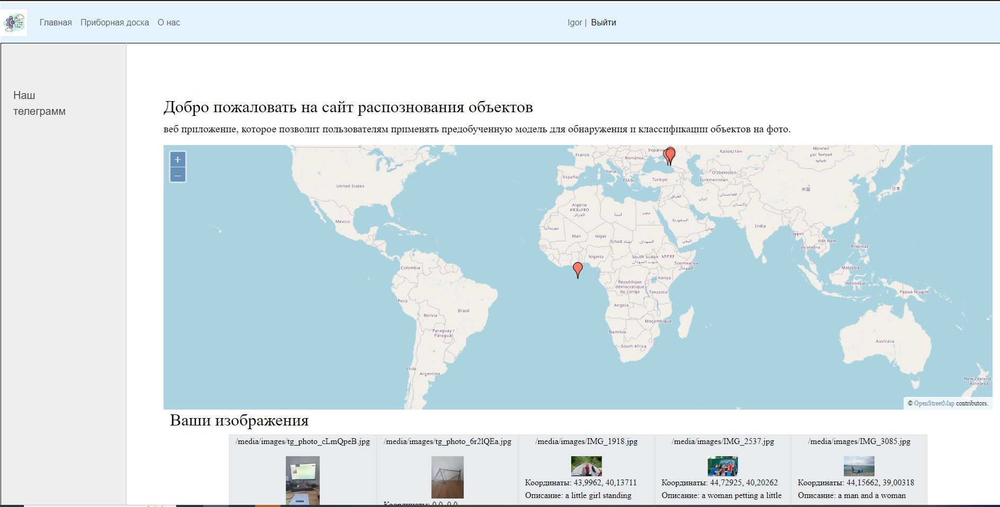
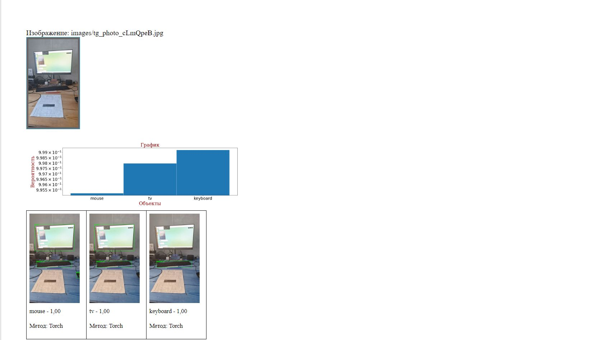
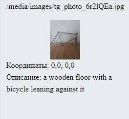
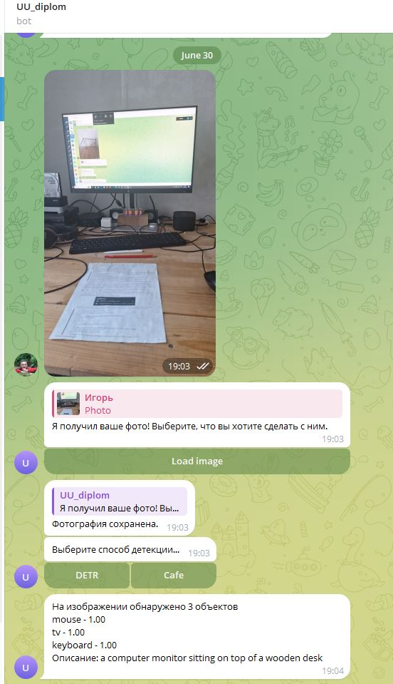

<h1> Проект по определению объектов на фотографиях 
</h1>
<h3 align="center">Проект позволяет определять объекты на загруженных фотографиях.</h3>

 
Языки и технологии в проекте 
&nbsp;
&nbsp;
&nbsp;
&nbsp;
&nbsp;
&nbsp;
&nbsp;
&nbsp;
&nbsp;
&nbsp;
&nbsp;
&nbsp;
&nbsp;
&nbsp;

Реализованы следующие возможности:
<ul>
<li>Реализовано отображение гео меток фотографий на карте
 

 
</li>
<li>Распознавание объектов на фотографии двумя методами, с выводом статистики</li>

 
<li>Генерирование описания фотографии</li>

 
<li>Работа с телеграмм ботом</li>

</ul>

